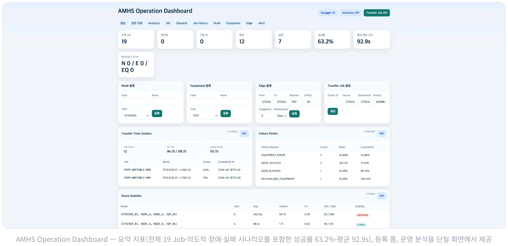
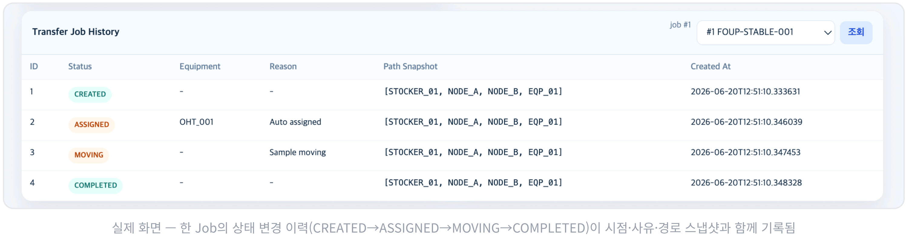
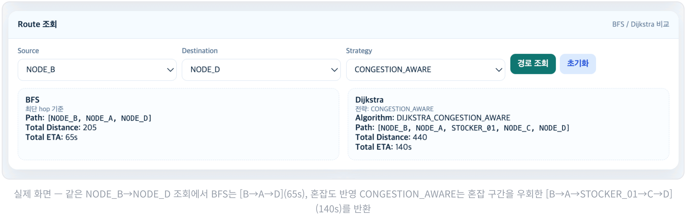
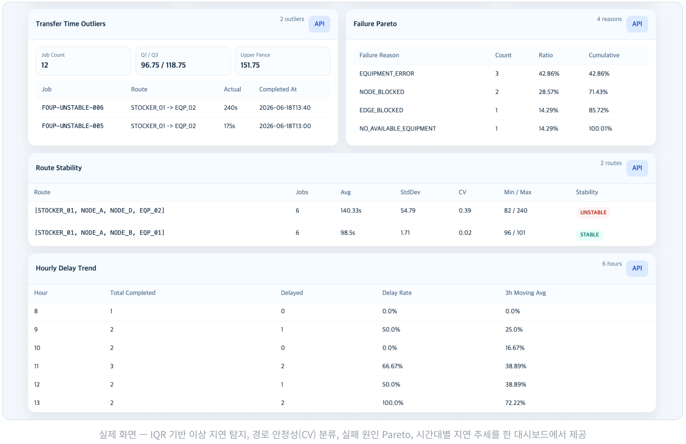
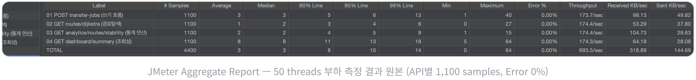

# AMHS Backend



대시보드 전체 화면 예시: 운영 요약 지표, 등록 폼, Analytics, Route 조회, Transfer Job 관리 화면을 한 페이지에서 확인할 수 있습니다.

Spring Boot 기반 AMHS 반송 Job 경로 탐색 및 상태 관리 시스템입니다.  
반도체 FAB 내부의 반송 흐름을 단순화해서 Node, Edge, Equipment, Transfer Job, Alert, Dashboard를 백엔드 중심으로 모델링했습니다.

## 프로젝트 목적

이 프로젝트는 자동 반송 환경에서 중요한 상태 관리, 경로 탐색, 장비 할당, 장애 감지 흐름을 서버 관점에서 구현하는 것을 목표로 합니다.

- 반송 대상 이동 Job 생성
- Node / Edge 상태 기반 경로 탐색
- 장애 구간 우회 처리
- 장비 자동 할당
- Job 상태 변경 이력 관리
- 실패 Job 재처리
- 지연 / 장애 알림 감지
- 운영 현황 요약 조회

## 도메인 설명

### AMHS Node

FAB 내부의 이동 지점입니다.

- 예: `STOCKER_01`, `NODE_A`, `EQP_01`
- 상태: `AVAILABLE`, `BLOCKED`
- 타입: `STOCKER`, `OHT_NODE`, `EQP`, `PORT`

### AMHS Edge

Node와 Node 사이의 이동 경로입니다.

- 방향성을 가진 간선
- 상태: `AVAILABLE`, `BLOCKED`
- 거리와 예상 이동 시간 보유
- 혼잡도 `congestionLevel (0~100)` 보유

### Equipment

반송 작업과 연관된 장비입니다.

- 예: `OHT_001`, `CONVEYOR_001`
- 상태: `IDLE`, `MOVING`, `ERROR`, `MAINTENANCE`

### Transfer Job

Carrier를 출발 Node에서 목적 Node로 이동시키는 반송 작업입니다.

- 상태: `CREATED`, `ASSIGNED`, `MOVING`, `COMPLETED`, `FAILED`, `CANCELED`
- 우선순위: `NORMAL`, `HIGH`, `URGENT`
- 생성 시 Dijkstra 경로 탐색 수행
- 상태 변경 시 이력 저장
- 상태 전이 규칙 적용

### Transfer Job History



한 Job의 상태 변경 이력 예시: `CREATED -> ASSIGNED -> MOVING -> COMPLETED` 흐름과 함께 시점, 사유, 경로 스냅샷을 추적할 수 있습니다.

Transfer Job의 상태 변경 이력을 저장합니다.

- 상태
- 사유
- 할당 장비 코드
- 경로 스냅샷

### Alert

운영 중 발생하는 지연 / 장애 상황을 알림으로 관리합니다.

- 타입: `DELAYED_JOB`, `STUCK_JOB`, `EQUIPMENT_ERROR`, `ROUTE_BLOCKED`
- 상태: `OPEN`, `RESOLVED`

## 주요 기능

- Node 등록, 조회, 상태 변경
- Edge 등록, 조회, 상태 변경, 혼잡도 변경
- Equipment 등록, 조회, 상태 변경
- BFS 경로 탐색
- Dijkstra 최단 예상 시간 경로 탐색
- `CONGESTION_AWARE` 전략 기반 경로 탐색
- `BLOCKED` Node / Edge 제외 후 우회 경로 계산
- Transfer Job 생성 시 경로 저장
- Transfer Job 상태 변경 및 이력 저장
- Transfer Job 상태 전이 규칙 검증
- 실패 Job retry
- 장비 자동 할당 및 대기 Job 일괄 할당
- 배정 후보 Queue 조회
- 지연 / 장애 Alert 감지 Scheduler
- Dashboard 요약 통계 조회
- 로컬 실행 시 샘플 데이터 자동 생성

## 기술 스택

- Java 21
- Spring Boot 3.5.x
- Spring Web
- Spring Data JPA
- Validation
- H2 Database
- MariaDB profile 분리
- Swagger / OpenAPI
- JUnit 5
- Gradle
- Lombok

## 테이블 구조

### `amhs_nodes`

- `id`
- `code`
- `name`
- `type`
- `status`
- `created_at`
- `updated_at`

### `amhs_edges`

- `id`
- `from_node_id`
- `to_node_id`
- `distance`
- `estimated_time_seconds`
- `congestion_level`
- `status`
- `created_at`
- `updated_at`

### `equipments`

- `id`
- `code`
- `name`
- `type`
- `status`
- `created_at`
- `updated_at`

### `transfer_jobs`

- `id`
- `carrier_id`
- `source_node_id`
- `destination_node_id`
- `assigned_equipment_id`
- `status`
- `priority`
- `path`
- `estimated_time_seconds`
- `retry_count`
- `failure_reason`
- `created_at`
- `updated_at`
- `started_at`
- `completed_at`
- `failed_at`
- `actual_transfer_time_seconds`

### `transfer_job_histories`

- `id`
- `transfer_job_id`
- `status`
- `reason`
- `assigned_equipment_code`
- `path_snapshot`
- `created_at`

### `alerts`

- `id`
- `transfer_job_id`
- `type`
- `status`
- `message`
- `created_at`
- `updated_at`
- `resolved_at`

## 상태 전이

Transfer Job은 다음 상태 전이 규칙을 가집니다.

- `CREATED -> ASSIGNED`
- `CREATED -> CANCELED`
- `ASSIGNED -> MOVING`
- `ASSIGNED -> FAILED`
- `ASSIGNED -> CANCELED`
- `MOVING -> COMPLETED`
- `MOVING -> FAILED`
- `FAILED -> CREATED` 는 일반 상태 변경이 아니라 `retry` 동작에서만 허용

완료되거나 취소된 Job이 다시 이동 상태로 돌아가는 흐름은 차단합니다.

## 경로 탐색 방식



같은 `NODE_B -> NODE_D` 조회에서도 BFS는 최소 hop 경로를, `CONGESTION_AWARE`는 혼잡 구간을 우회한 경로를 반환합니다.

### BFS

가중치를 고려하지 않고, 거쳐가는 Node 수가 가장 적은 경로를 찾습니다.

예:

`STOCKER_01 -> NODE_A -> EQP_01`

### Dijkstra (TIME)

`estimatedTimeSeconds` 기준으로 총 예상 이동 시간이 가장 짧은 경로를 찾습니다.

예:

`STOCKER_01 -> NODE_B -> EQP_01`

### Dijkstra (CONGESTION_AWARE)

가중치를 `estimatedTimeSeconds + congestionLevel`로 계산합니다.

혼잡도가 높은 구간이 있으면 단순 최단 시간 대신 운영 상황을 반영한 경로를 선택할 수 있습니다.

## 장애 우회 예시

기본 경로가 다음과 같다고 가정합니다.

`STOCKER_01 -> NODE_B -> EQP_01`

여기서 `NODE_B` 또는 `STOCKER_01 -> NODE_B` Edge가 `BLOCKED`가 되면, 시스템은 해당 구간을 제외하고 우회 경로를 다시 계산합니다.

예:

`STOCKER_01 -> NODE_A -> EQP_01`

## 장비 자동 할당

대기 중인 Job은 장비 상태와 우선순위를 기준으로 자동 할당할 수 있습니다.

- 할당 대상 장비: `IDLE`
- 제외 장비: `ERROR`, `MAINTENANCE`
- 배정 후보 정렬:
- `priority`: `URGENT > HIGH > NORMAL`
- `createdAt`: 오래된 순
- `retryCount`: 낮은 순

개별 할당:

- `POST /api/transfer-jobs/{id}/assign`

일괄 할당:

- `POST /api/transfer-jobs/assign-pending`

배정 후보 조회:

- `GET /api/transfer-jobs/dispatch-candidates`

## Alert / Scheduler

Scheduler가 주기적으로 운영 이상 징후를 감지합니다.

- `ASSIGNED` 상태가 오래 유지되면 `STUCK_JOB`
- `MOVING` 상태가 예상 시간보다 오래 지속되면 `DELAYED_JOB`
- `ERROR` 장비에 할당된 Job은 `FAILED` 처리 후 `EQUIPMENT_ERROR` 알림 생성

알림 조회 / 해제 API:

- `GET /api/alerts`
- `PATCH /api/alerts/{id}/resolve`

## 실행 방법

### 1. 애플리케이션 실행

```bash
./gradlew bootRun
```

기본 프로필은 `local`이며 H2 in-memory DB를 사용합니다.

### 2. Swagger 접속

- `http://localhost:8080/swagger-ui.html`

### 3. H2 Console 접속

- `http://localhost:8080/h2-console`

## 샘플 데이터

로컬 프로필 실행 시 샘플 데이터가 자동 생성됩니다.

### Node

- `STOCKER_01`
- `NODE_A`
- `NODE_B`
- `NODE_C`
- `NODE_D`
- `EQP_01`
- `EQP_02`

### Equipment

- `OHT_001`
- `OHT_002`
- `CONVEYOR_001`

### Edge

- `STOCKER_01 -> NODE_A`
- `NODE_A -> NODE_B`
- `NODE_B -> EQP_01`
- `STOCKER_01 -> NODE_C`
- `NODE_C -> NODE_D`
- `NODE_D -> EQP_02`
- `NODE_A -> NODE_D`

역방향 경로도 함께 넣어두어 Swagger에서 바로 경로 탐색과 Job 생성을 테스트할 수 있습니다.

## 시연 시나리오

### 시나리오 1. 정상 반송

1. `POST /api/transfer-jobs`로 `STOCKER_01 -> EQP_01` Job 생성
2. Dijkstra 경로 계산 결과 확인
3. `POST /api/transfer-jobs/{id}/assign`으로 `OHT_001` 자동 할당
4. `PATCH /api/transfer-jobs/{id}/status`로 `MOVING`
5. `PATCH /api/transfer-jobs/{id}/status`로 `COMPLETED`
6. `GET /api/transfer-jobs/{id}/histories`로 이력 확인

### 시나리오 2. 장애 우회

1. `PATCH /api/nodes/{id}/status` 또는 `PATCH /api/edges/{id}/status`로 장애 구간 설정
2. `GET /api/routes/dijkstra` 재호출
3. `BLOCKED` 구간을 제외한 우회 경로 확인

### 시나리오 3. 실패 후 재처리

1. Job 생성 및 장비 할당
2. 상태를 `MOVING -> FAILED`로 변경
3. 장애 Edge를 복구하거나 다른 경로를 열어둠
4. `POST /api/transfer-jobs/{id}/retry`
5. 새 경로 계산 및 `CREATED` 상태 복구 확인

### 시나리오 4. 지연 감지

1. Job 생성 후 장비 할당
2. `ASSIGNED` 또는 `MOVING` 상태 유지
3. Scheduler 감지 후 `GET /api/alerts`로 `STUCK_JOB` 또는 `DELAYED_JOB` 확인
4. `PATCH /api/alerts/{id}/resolve`로 알림 해제

### 시나리오 5. 혼잡도 반영 경로 선택

1. `PATCH /api/edges/{id}/congestion`으로 특정 구간 혼잡도 증가
2. `GET /api/routes/dijkstra?source=...&destination=...&strategy=TIME`
3. `GET /api/routes/dijkstra?source=...&destination=...&strategy=CONGESTION_AWARE`
4. 전략에 따라 선택 경로가 달라지는지 비교

## API 목록

### Node API

- `POST /api/nodes`
- `GET /api/nodes`
- `GET /api/nodes/{id}`
- `PATCH /api/nodes/{id}/status`

### Edge API

- `POST /api/edges`
- `GET /api/edges`
- `GET /api/edges/{id}`
- `PATCH /api/edges/{id}/status`
- `PATCH /api/edges/{id}/congestion`

### Equipment API

- `POST /api/equipments`
- `GET /api/equipments`
- `GET /api/equipments/{id}`
- `PATCH /api/equipments/{id}/status`

### Route API

- `GET /api/routes/bfs?source=STOCKER_01&destination=EQP_01`
- `GET /api/routes/dijkstra?source=STOCKER_01&destination=EQP_01&strategy=TIME`
- `GET /api/routes/dijkstra?source=STOCKER_01&destination=EQP_01&strategy=CONGESTION_AWARE`

### Transfer Job API

- `POST /api/transfer-jobs`
- `GET /api/transfer-jobs`
- `GET /api/transfer-jobs/dispatch-candidates`
- `GET /api/transfer-jobs/{id}`
- `PATCH /api/transfer-jobs/{id}/status`
- `POST /api/transfer-jobs/{id}/assign`
- `POST /api/transfer-jobs/assign-pending`
- `POST /api/transfer-jobs/{id}/retry`
- `GET /api/transfer-jobs/{id}/histories`

### Alert API

- `GET /api/alerts`
- `PATCH /api/alerts/{id}/resolve`

### Dashboard API

- `GET /api/dashboard/summary`

## Analytics - AMHS 운영 데이터 분석



Analytics 화면 예시: IQR 기반 이상 지연 탐지, 경로 안정성(CV), 실패 원인 Pareto, 시간대별 지연 추세를 한 화면에서 확인할 수 있습니다.

이 프로젝트는 AMHS 반송 Job을 단순히 생성하고 상태를 변경하는 데 그치지 않고, 완료/실패 Job 데이터를 기반으로 운영 성능을 분석할 수 있도록 확장했습니다. 평균, 표준편차, 변동계수, 사분위수, IQR, 파레토 분석, 이동평균 개념을 적용하여 이상 지연 Job, 불안정 경로, 주요 실패 원인, 시간대별 지연 추세를 확인할 수 있도록 구현했습니다.

### Analytics 기능을 추가한 이유

반송 시스템은 정상 동작 여부만 확인하는 것으로는 운영 품질을 충분히 설명하기 어렵습니다.

- 어떤 Job이 비정상적으로 오래 걸렸는지
- 특정 경로가 평균적으로는 빨라도 실제 운행 편차가 큰지
- 실패 원인 중 어떤 이슈가 가장 큰 비중을 차지하는지
- 특정 시간대에 지연이 집중되는지

위 정보를 운영 데이터에서 바로 분석할 수 있어야 장애 대응, 경로 개선, 장비 운영 전략 수립에 활용할 수 있습니다.

### 프로젝트에서 사용한 통계 / 분석 개념

- 평균: 경로별 대표 반송 시간 계산
- 표준편차: 경로별 시간 분산 정도 계산
- 변동계수(CV): 평균 대비 변동성 비교
- 사분위수(Q1, Q3): 반송 시간 분포의 기준점 파악
- IQR: 이상 지연 Job 탐지 기준 계산
- 파레토 분석: 실패 원인별 집중도 확인
- 이동평균: 시간대별 지연률 추세 완화 및 흐름 확인

### 1. IQR 기반 이상 지연 Job 탐지

완료된 Job의 `actualTransferTimeSeconds`를 기준으로 사분위수와 IQR을 계산하고, `Upper Fence = Q3 + 1.5 * IQR`보다 큰 Job을 이상 지연 Job으로 분류합니다.

- 분석 대상: `status = COMPLETED`, `actualTransferTimeSeconds != null`
- 반환 값: `jobCount`, `q1`, `q3`, `iqr`, `outlierThreshold`, `outlierCount`, `outlierJobs`
- 데이터가 4건 미만이면 IQR 계산 신뢰도가 낮다고 보고 핵심 통계값은 `null`로 반환합니다.

응답 예시:

```json
{
  "jobCount": 20,
  "q1": 42.0,
  "q3": 95.0,
  "iqr": 53.0,
  "outlierThreshold": 174.5,
  "outlierCount": 2,
  "outlierJobs": [
    {
      "jobId": 12,
      "carrierId": "FOUP-012",
      "sourceNodeCode": "STOCKER_01",
      "destinationNodeCode": "EQP_02",
      "actualTransferTimeSeconds": 210,
      "path": ["STOCKER_01", "NODE_A", "NODE_D", "EQP_02"],
      "completedAt": "2026-06-18T10:30:00"
    }
  ]
}
```

### 2. 경로별 평균 / 표준편차 / 변동계수 기반 불안정 경로 탐지

동일 경로로 완료된 Job들을 묶어 평균 반송 시간, 표준편차, 변동계수(CV)를 계산하고 경로 안정성을 분류합니다.

- 분석 대상: `status = COMPLETED`, `actualTransferTimeSeconds != null`, `path != null`
- 그룹 기준: `path`
- 안정성 분류:
- `CV < 0.15` -> `STABLE`
- `0.15 <= CV < 0.35` -> `MODERATE`
- `CV >= 0.35` -> `UNSTABLE`

평균 시간이 짧더라도 편차가 큰 경로는 운영상 불안정한 경로로 판단할 수 있도록 설계했습니다.

응답 예시:

```json
[
  {
    "route": ["STOCKER_01", "NODE_A", "EQP_01"],
    "jobCount": 20,
    "averageTransferTimeSeconds": 80.5,
    "standardDeviation": 5.2,
    "coefficientOfVariation": 0.06,
    "minTransferTimeSeconds": 72,
    "maxTransferTimeSeconds": 91,
    "stability": "STABLE"
  },
  {
    "route": ["STOCKER_01", "NODE_D", "EQP_02"],
    "jobCount": 18,
    "averageTransferTimeSeconds": 82.1,
    "standardDeviation": 39.8,
    "coefficientOfVariation": 0.48,
    "minTransferTimeSeconds": 50,
    "maxTransferTimeSeconds": 180,
    "stability": "UNSTABLE"
  }
]
```

### 3. 실패 원인 파레토 분석

`FAILED` 상태 Job을 `failureReason` 기준으로 집계해 count, ratio, cumulativeRatio를 계산합니다.

- 분석 대상: `status = FAILED`, `failureReason != null`
- 정렬 기준: `count` 내림차순, 같으면 `failureReason` 오름차순
- 목적: 어떤 실패 원인이 전체 실패의 대부분을 차지하는지 빠르게 파악

응답 예시:

```json
[
  {
    "failureReason": "EQUIPMENT_ERROR",
    "count": 12,
    "ratio": 40.0,
    "cumulativeRatio": 40.0
  },
  {
    "failureReason": "NODE_BLOCKED",
    "count": 8,
    "ratio": 26.7,
    "cumulativeRatio": 66.7
  },
  {
    "failureReason": "EDGE_BLOCKED",
    "count": 5,
    "ratio": 16.7,
    "cumulativeRatio": 83.4
  }
]
```

### 4. 시간대별 지연률 + 이동평균 추세 분석

완료된 Job을 `completedAt`의 hour 기준으로 그룹화하고, `actualTransferTimeSeconds > estimatedTimeSeconds`인 경우를 지연으로 판단해 시간대별 지연률과 3시간 이동평균을 계산합니다.

- 분석 대상: `status = COMPLETED`, `completedAt != null`, `actualTransferTimeSeconds != null`
- 그룹 기준: `completedAt.hour`
- 지연 기준: `actualTransferTimeSeconds > estimatedTimeSeconds`
- 이동평균: 최근 3개 시간대의 `delayRate` 평균

시간대별 순간 값뿐 아니라 최근 흐름을 같이 보여주기 때문에 추세성 분석에 유용합니다.

응답 예시:

```json
[
  {
    "hour": 9,
    "totalCompletedJobs": 12,
    "delayedJobs": 3,
    "delayRate": 25.0,
    "movingAverageDelayRate": 18.3
  },
  {
    "hour": 10,
    "totalCompletedJobs": 8,
    "delayedJobs": 2,
    "delayRate": 25.0,
    "movingAverageDelayRate": 21.7
  },
  {
    "hour": 11,
    "totalCompletedJobs": 10,
    "delayedJobs": 5,
    "delayRate": 50.0,
    "movingAverageDelayRate": 33.3
  }
]
```

### Analytics API 목록

- `GET /api/analytics/transfer-time/outliers`
- `GET /api/analytics/routes/stability`
- `GET /api/analytics/failures/pareto`
- `GET /api/analytics/delays/hourly-trend`

### 추후 HTML Dashboard 확장 계획

현재 Analytics는 REST API와 응답 DTO 중심으로 구성되어 있고, 추후 같은 `AnalyticsService`를 재사용해서 다음 화면으로 확장할 수 있습니다.

- Analytics Dashboard
- 이상 지연 Job 목록 화면
- 경로별 안정성 분석 화면
- 실패 원인 파레토 차트 화면
- 시간대별 지연 추세 차트 화면

즉, 이번 구현은 API만 추가한 것이 아니라 이후 서버 렌더링 View나 프론트엔드 대시보드로 확장 가능한 분석 계층까지 포함한 구조입니다.

### 포트폴리오 어필 포인트

- 단순 CRUD를 넘어서 운영 데이터 분석까지 확장한 백엔드 설계 경험을 보여줄 수 있습니다.
- 도메인 상태 관리와 통계 분석 로직을 분리해 서비스 계층 재사용성을 확보했습니다.
- API 응답을 HTML Dashboard, 차트, 보고서 용도로 재사용하기 쉽게 DTO 중심으로 설계했습니다.
- 실제 운영 관점에서 의미 있는 질문을 코드로 풀었습니다.
  예: 어떤 Job이 이상 지연인지, 어떤 경로가 불안정한지, 어떤 실패 원인이 핵심인지, 어느 시간대에 지연이 몰리는지
- 데이터 분석 학습 과정에서 익힌 개념을 서비스 도메인에 직접 적용한 사례로 설명할 수 있습니다.

## 테스트 방법

전체 테스트 실행:

```bash
./gradlew test
```

로컬 부하 측정 예시(JMeter Aggregate Report):



현재 포함된 주요 테스트 항목:

- BFS 경로 탐색 성공
- Dijkstra 경로 탐색 성공
- `BLOCKED` Node 제외 후 우회 경로 탐색
- `BLOCKED` Edge 제외 후 우회 경로 탐색
- 혼잡도 반영 경로 탐색
- 경로가 없을 때 예외 발생
- Transfer Job 생성 시 경로 저장
- Transfer Job 상태 변경 시 History 저장
- `FAILED` Job retry 성공
- `FAILED`가 아닌 Job retry 시 예외 발생
- 장비 자동 할당 및 대기 Job 일괄 할당
- 배정 후보 Queue 정렬 검증
- 상태 전이 규칙 검증
- Alert 감지 및 resolve 검증
- Dashboard summary 집계 검증
- IQR 기반 이상 지연 Job 탐지
- 경로별 평균 / 표준편차 / 변동계수 기반 안정성 분류
- 실패 원인 파레토 분석
- 시간대별 지연률 및 3시간 이동평균 계산

## 구현 포인트

- 상태값과 상태 전이 규칙을 중심으로 도메인을 구성해 비정상 흐름을 차단했습니다.
- 경로 탐색은 BFS, Dijkstra(TIME), Dijkstra(CONGESTION_AWARE)로 분리해 운영 상황에 따라 비교할 수 있게 했습니다.
- 장애 상태인 Node / Edge를 탐색 대상에서 제외해 경로 재계산 시나리오를 반영했습니다.
- 대기 중인 Job을 우선순위와 장비 상태 기준으로 정렬해 자동 할당할 수 있도록 구성했습니다.
- Transfer Job 이력을 별도 테이블로 관리해 반송 흐름과 장애 복구 이력을 추적할 수 있도록 했습니다.
- Scheduler와 Alert 도메인을 통해 지연 / 장비 이상 상황을 운영 관점에서 확인할 수 있도록 구성했습니다.
